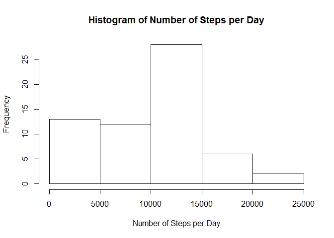
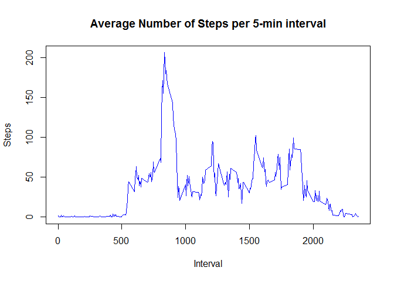
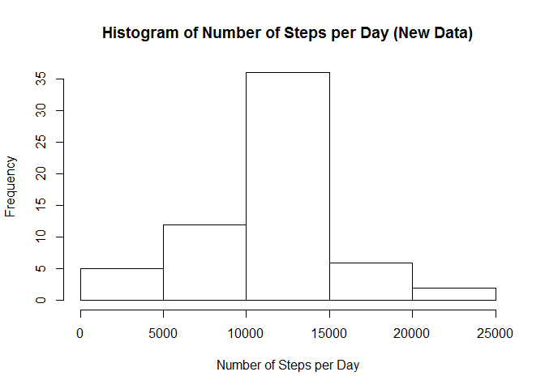
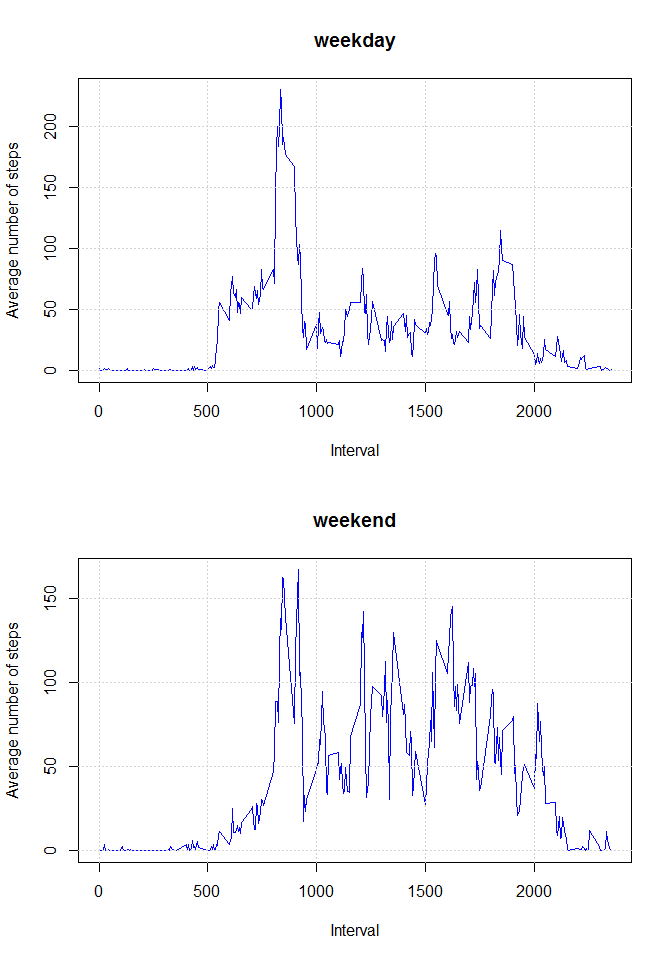

# Reproducible Research - Peer Assessment 1
Ianik Pomorski  
Friday, May 15, 2015  

##Loading and preprocessing the data

1. Load the data

```r
data <- read.csv("activity.csv")
```

2. Process/transform the data into a format suitable for your analysis and print a summary of the data frame.


```r
## Change date column type as date
data$date <- as.Date(data$date)
summary(data)
```

```
##      steps             date               interval     
##  Min.   :  0.00   Min.   :2012-10-01   Min.   :   0.0  
##  1st Qu.:  0.00   1st Qu.:2012-10-16   1st Qu.: 588.8  
##  Median :  0.00   Median :2012-10-31   Median :1177.5  
##  Mean   : 37.38   Mean   :2012-10-31   Mean   :1177.5  
##  3rd Qu.: 12.00   3rd Qu.:2012-11-15   3rd Qu.:1766.2  
##  Max.   :806.00   Max.   :2012-11-30   Max.   :2355.0  
##  NA's   :2304
```

##What is mean total number of steps taken per day?

1. Calculate the total number of steps taken per day

```r
## Use the sum and aggregate functions to store data in a new data frame
aggregate_data <-aggregate(data$steps, by=list(data$date),"sum", na.rm=TRUE)

## rename columns
colnames(aggregate_data)<-c("date","steps")
```

2. Make a histogram of the total number of steps taken each day

```r
hist(aggregate_data$steps, main = "Histogram of Number of Steps per Day",
                                xlab = "Number of Steps per Day" )
```

 

3. Calculate and report the mean and median of the total number of steps taken per day

```r
## Calculate Mean
mu<-mean(aggregate_data$steps,na.rm=TRUE)

## Calculate Median
med<-median(aggregate_data$steps,na.rm=TRUE)
```
The Mean is **9354.2295082**.

The Median is **10395**.

##What is the average daily activity pattern?

1. Make a time series plot (i.e. type = "l") of the 5-minute interval (x-axis) and the average number of steps taken, averaged across all days (y-axis)

```r
## Use aggregate and mean functions to store mean of steps per interval in a
## new data frame
interval_data <- aggregate(data$steps, by=list(data$interval),"mean",na.rm=TRUE)

## Rename columns
colnames(interval_data)<-c("Interval","Steps")

## Draw the time seris plot
plot(interval_data, type = "l", 
     main = "Average Number of Steps per 5-min interval", 
     col="blue")
```

 

2. Which 5-minute interval, on average across all the days in the dataset, contains the maximum number of steps?

```r
## Extract all interval that have the max of steps
max_interval <- subset(interval_data, Steps == max(interval_data$Steps))

## Print le data frame (in case there are more than one interval with the max)
## the first column shows the intervals: 835(ie 08:35) 
## the second column shows the max of the averages
print(max_interval)
```

```
##     Interval    Steps
## 104      835 206.1698
```

##Imputing missing values

1. Calculate and report the total number of missing values in the dataset (i.e. the total number of rows with NAs)

```r
## Extract all the data where the number of steps is na in a new data frame
na_data <- subset(data, is.na(steps))

## Count the number of rows 
number<-nrow(na_data)
```
The total number of missing values in the dataset is **2304**.

2. Devise a strategy for filling in all of the missing values in the dataset: 
*We will use the mean for that 5-minute interval to replace the missing values.*

3. Create a new dataset that is equal to the original dataset but with the missing data filled in.

```r
## Copy dataset to a new data set
newdata <- data

## Get all the rows of the NA values in a vector
indx <- which(is.na(newdata[, 1])==TRUE)

## Replace in these rows the steps value by the mean from the interval
for(i in indx) 
      newdata$steps[i]<- interval_data$Steps[interval_data$Interval==newdata$interval[i]]

## Show the first 10 rows new dataset (old dataset had NA in the first 288 rows)
head(newdata,10)
```

```
##        steps       date interval
## 1  1.7169811 2012-10-01        0
## 2  0.3396226 2012-10-01        5
## 3  0.1320755 2012-10-01       10
## 4  0.1509434 2012-10-01       15
## 5  0.0754717 2012-10-01       20
## 6  2.0943396 2012-10-01       25
## 7  0.5283019 2012-10-01       30
## 8  0.8679245 2012-10-01       35
## 9  0.0000000 2012-10-01       40
## 10 1.4716981 2012-10-01       45
```

```r
## Show the first 10 rows of interval dataset to check that correct values were added
head(interval_data,10)
```

```
##    Interval     Steps
## 1         0 1.7169811
## 2         5 0.3396226
## 3        10 0.1320755
## 4        15 0.1509434
## 5        20 0.0754717
## 6        25 2.0943396
## 7        30 0.5283019
## 8        35 0.8679245
## 9        40 0.0000000
## 10       45 1.4716981
```

4. Make a histogram of the total number of steps taken each day and Calculate and report the mean and median total number of steps taken per day. Do these values differ from the estimates from the first part of the assignment? What is the impact of imputing missing data on the estimates of the total daily number of steps?


```r
## Use the same process as before
## Use the sum and aggregate functions to store data in a new data frame
aggregate_newdata <-aggregate(newdata$steps, by=list(newdata$date),"sum", na.rm=TRUE)

## rename columns
colnames(aggregate_newdata)<-c("date","steps")

## Draw histogram
hist(aggregate_newdata$steps, main = "Histogram of Number of Steps per Day (New Data)",
                                xlab = "Number of Steps per Day" )
```

 

```r
## Calculate Mean
new_mu<-mean(aggregate_newdata$steps,na.rm=TRUE)

## Calculate Median
new_med<-median(aggregate_newdata$steps,na.rm=TRUE)
```
The new Mean is **1.0766189\times 10^{4}**.

The new Median is **1.0766189\times 10^{4}**.

####*Changing the data increased the frequency of days with steps close to a value of 10,766 which the mean and median value.  See on the histogram the frenquency of days with steps between 10,000 and 15,000 is higher.*

##Are there differences in activity patterns between weekdays and weekends?

1. Create a new factor variable in the dataset with two levels - "weekday" and "weekend" indicating whether a given date is a weekday or weekend day

```r
## Create a function that get a date and return if it's weekday or weekend
weekday_function <- function (x= date())
{
     if (weekdays(x)=="Sunday" || weekdays(x)=="Saturday")
          return("weekend")
     else
          return("weekday") 
}

## Use function to add a column in the new dataset based on the date of the row
for (i in 1:nrow(newdata)) 
      newdata$wkday[i] <- weekday_function(as.Date(newdata$date[i]))

## Turn this new column into a factor
newdata$wkday <- as.factor(newdata$wkday)

## show summary of this new dataset
summary(newdata)
```

```
##      steps             date               interval          wkday      
##  Min.   :  0.00   Min.   :2012-10-01   Min.   :   0.0   weekday:12960  
##  1st Qu.:  0.00   1st Qu.:2012-10-16   1st Qu.: 588.8   weekend: 4608  
##  Median :  0.00   Median :2012-10-31   Median :1177.5                  
##  Mean   : 37.38   Mean   :2012-10-31   Mean   :1177.5                  
##  3rd Qu.: 27.00   3rd Qu.:2012-11-15   3rd Qu.:1766.2                  
##  Max.   :806.00   Max.   :2012-11-30   Max.   :2355.0
```

2. Make a panel plot containing a time series plot (i.e. type = "l") of the 5-minute interval (x-axis) and the average number of steps taken, averaged across all weekday days or weekend days (y-axis). 

```r
## Split the new dataset according to the new factor
x <- split(newdata,newdata$wkday)

par(mfrow=c(2,1))
for (i in 1:length(x)) {
      ## Use aggregate and mean functions to store mean of steps per interval in each dataset
      tmpdata <- aggregate(x[[i]]$steps, by=list(x[[i]]$interval),
                           "mean",na.rm=TRUE)
      sname <- names(x)[i]
      
      ## Create plot for each dataset
      plot(tmpdata, 
           main = sname,
           xlab = "Interval",
           ylab = "Average number of steps",
           type = "l",
           col="blue")
      grid()
}
```

 
